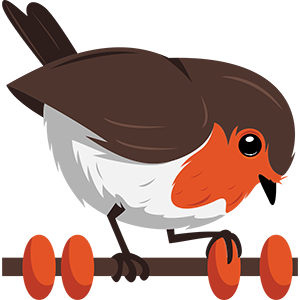

<!-- :female_detective: Looking for a new champion -->

# DAppNode package _Rotki_

<!--DAppNode package logo (could be added with an hyperlink to a youtube video): -->

<!--Brief introduction about the source project (official project definition is an option): -->

Rotki is an opensource portfolio tracking, analytics, and tax reporting application that respects your privacy. It is focused on Crypto assets but will also slowly facilitate tracking of more traditional assets.

More information about the source project can be found at [their official website](https://rotki.com/)

### Why _Rotki_ ?

<!--What can you do with this package?: -->

Dashboard to manage accounts, exhchanges, DeDi, Ethereum protocols, Profit/Loss Report and much more!

Do not miss it!

### Requirements

Rquirements to run DAppNode package for Rotki

<!--Requirements to run the dappnode package in a list: -->

There are no requirements to run Rotki on your DAppNode. Anyway it is recommended to run your own Ethereum Node and introduce it at: **Account > settings > general > Local Nodes**. This feature makes the Rotki app run faster and you will keep your privacity!

### Manteinance

<!--Table with champion/s mantainers, versions and update status -->
<!--UPDATED: :x: OR :heavy_check_mark: -->

|      Updated       |   Champion/s   |
| :----------------: | :------------: |
| :heavy_check_mark: | @pablomendez95 |
